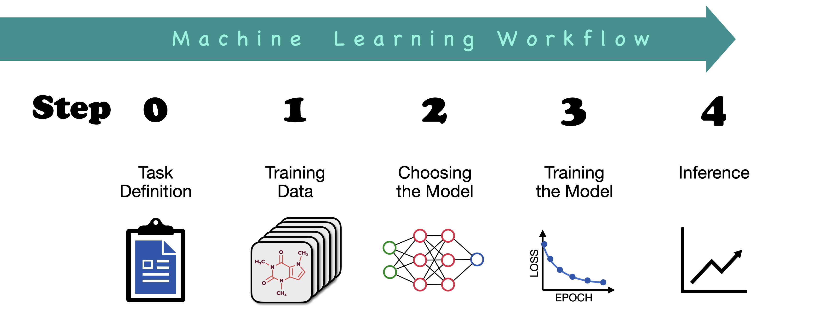

# CrashCourse_ML4Chem
Repository of the files for the *Crash Course on Machine Learning for Chemists*.

This two-hour crash course was give (for the first time) by Bernd Ensing and Robert Pollice on Monday, 25 November 2024, as part of the *ChemAI Week 2024* organized at the Science Park of the University of Amsterdam. Here you will find the slides and the jupyter notebooks that were presented, as well as the link to a video of the lectures.

Here are the files:
1. The video of the lectures by Bernd and Robert are on [this youtube video](https://youtu.be/EDlEMz5Elt0?si=adfiUDX4B_Ap0kYe).
1. The slides of the introduction lecture by Bernd are on [this github repository](https://github.com/Ensing-Laboratory/CrashCourse_ML4Chem/blob/main/Slides_Bernd-Ensing.pdf).
1. The jupyter notebook files of the lecture by Robert are also [here](https://github.com/Ensing-Laboratory/CrashCourse_ML4Chem/blob/main/ai_crash_course_bayesian_optimization.ipynb) and [here](https://github.com/Ensing-Laboratory/CrashCourse_ML4Chem/blob/main/ai_crash_course_supervised_learning.ipynb).

Enjoy!
